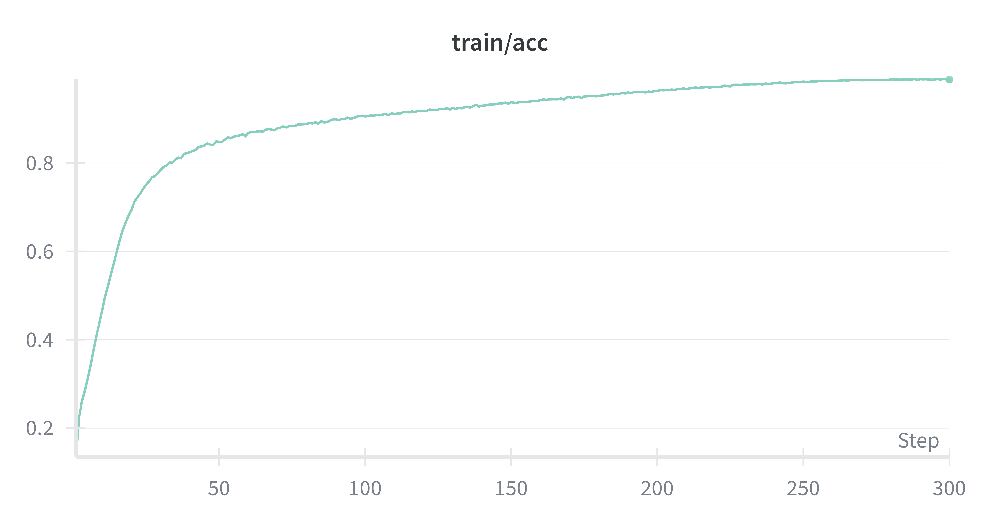
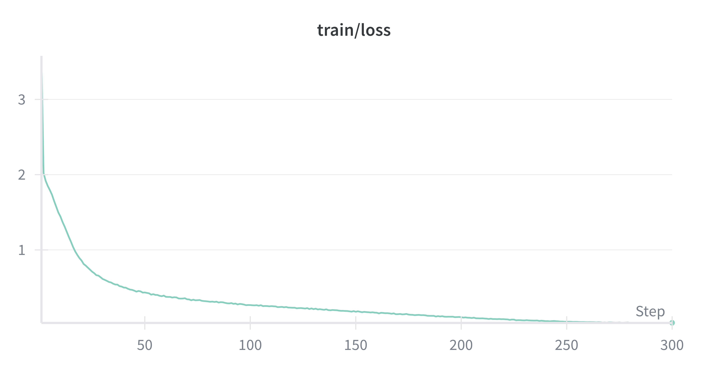
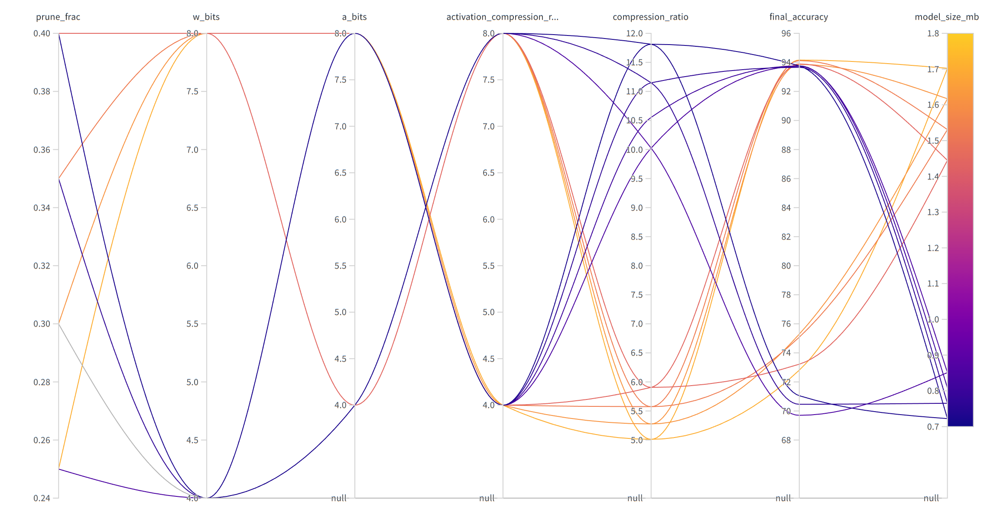
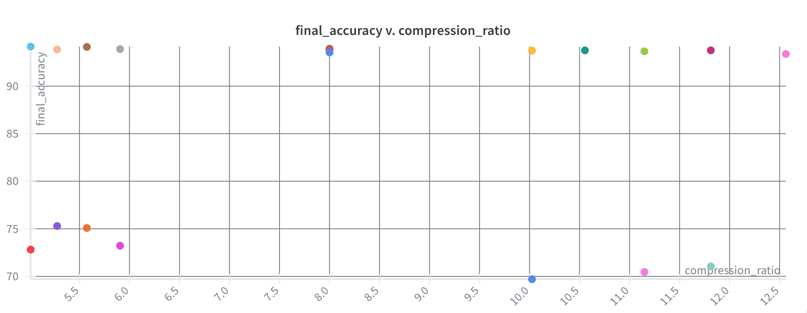

# CS6886 Assignment 3

B Santhanakrishnan DA24S001

## Question 1: Training Baseline

-   During training, each image is randomly cropped (32×32 with 4-pixel padding), randomly flipped horizontally, then normalized using the CIFAR-10 channel means `(0.4914, 0.4822, 0.4465)` and standard deviations `(0.2470, 0.2430, 0.2610)`. Finally, Cutout is applied to mask out a 16×16 patch. Cutout is a regularization technique that randomly masks out a square patch of the image to improve robustness. During validation/testing, we only do normalization.

-   I trained a MobileNetV2 with width multiplier 1.0, standard BatchNorm after each conv, and dropout only in the final classifier. Training used SGD with momentum 0.9, weight decay 4e-5, cosine-annealed learning rate starting at 0.4, batch size 512, and 300 epochs. To adapt the model from ImageNet (224×224) to CIFAR-10 (32×32), I modified the first convolution and early stage strides to 1 so that spatial resolution is preserved.

-   Baseline test accuracy: **94.58%**.

-   Loss/Accuracy curves

<center>
    
    
</center>

Please click [here(wandb.ai)](https://api.wandb.ai/links/porridgewithraisins-iit-madras/s9k7nmhw) to open a clickable version of these plots in wandb.

-   Failure modes

Refer to the confusion matrix (it might take a minute to load the sample misclassified images...) in the wandb report above.

Here's how to read it. The axes are as in any confusion matrix. Each cell has a sample misclassified image, or the text "0" representing 100% accuracy on that label pair. Next to that, it puts the number of misclassifications of that type. The diagonal cells have the number of correct classifications, as you might expect.

The top two failure modes are

-   65 failures - dog vs cat. Expected
-   20 failures - truck vs automobile. Understandable.

Insightful failure modes:

-   17 failures - airplane vs ship. I think because of blue background and "metallic" foreground?

## Question 2: Model Compression Implementation

### Design

I built a two–stage compression pipeline in `cs.py`.

I used fake-quantization (simulated int8/low-bit ops with quantize–dequantize wrappers) to measure accuracy and size, without replacing PyTorch kernels by true int8 ops - same approach as the template repo.

-   Pruning.

    -   Target only the expansion 1×1 convs inside MobileNetV2 blocks.
    -   Score channels by L1 norm of filter weights, prune the lowest prune_frac.
    -   Rebuild the block with fewer hidden channels (so params truly shrink), then copy weights and BN stats.
    -   Fine-tune for 15 epochs to recover accuracy.

-   Quantization aware training (QAT).

    -   Wrap all Conv2d layers (except the first input conv) with QuantWrapper.
    -   Weights quantized per-channel, signed int with configurable w_bits.
    -   Outputs fake-quantized with unsigned int, configurable a_bits.
    -   Biases always stay FP32.
    -   Train 10 QAT epochs to adapt.

Both steps are fully configurable by CLI flags (`--prune_frac`, `--w_bits`, `--a_bits`, `--ft_epochs`, `--qat_epochs`).

### Where is it applied?

-   Compressed all Conv2d blocks (weights), ReLU/ReLU6 activations (outputs).

-   Skipped first conv (in_channels==3) and final classifier Linear stay FP32 (for stability).

-   Pruning applied only to expansion convs inside inverted residuals.

### Rationale

I compressed MobileNetV2 in two stages: pruning and quantization. Expansion 1×1 convolutions dominated parameter cost, so I pruned the lowest-L1 channels to shrink hidden dimensions while leaving projections intact, then fine-tuned for recovery. Since CIFAR is a much "simpler" dataset than ImageNet, we also don't need that much representational power anyways. Then, quantization reduced precision: per-channel weight quantization preserved filter ranges, unsigned activation quantization fit post-ReLU outputs, and biases stayed FP32 (they are inconsequential to model size pretty much). I left the first conv and final classifier in FP32 since they were small but sensitive. This combination gave substantial compression with minimal accuracy loss.

### What did I intentionally not do?

The work in paper reading 4 applied k-means clustering and Huffman coding to further compress weights. I intentionally did not do this, since it only affects storage on disk, instead I focused on pruning and low-bit quantization for accuracy/size trade-offs.

I could have done k-means only, that would have given me approx 2-3x more compression in-memory since I get to store integers in 2-bits and so on. But decoding all that will be way slower in simulation without purpose-built kernels/hardware, so I didn't do it.

### Storage overhead breakdown

I estimated the extra bookkeeping I had to add on top of the raw quantized weights and biases: per-channel scales and zero-points, activation quant params, pruning masks, and a few bytes of per-layer flags. I counted scales/zps as float32 (4 B each) and biases kept in FP32; masks I bit-packed (1 bit per channel). Looking at the architecture and the layer counts produced by the pruning code, the rough numbers were: per-channel weight scales ≈ 2,816 × 4 B ≈ 11 KB, per-channel zps ≈ 11 KB, biases ≈ 11 KB, activation quant params ≈ 34 × 8 B ≈ 0.3 KB, prune masks ≈ 6.5k bits ≈ 0.8 KB, and tiny per-layer meta ≈ 0.1 KB — total ≈ ~34 KB (≈0.033 MB). I report sizes using the formula I used in the code:

final_size = quantized_weight_bytes + bias_bytes + sum(scale_bytes + zp_bytes) + mask_bytes + small_meta_bytes.

Interpretation: these overheads are negligible versus the quantized weight storage (they're on the order of 0.02–0.05 MB), so they do not materially affect the reported compression ratios; if I store zps as int8 and keep masks bit-packed the overhead falls further. If zero-points are int8 (1 B each) and masks bit-packed, the overhead drops from ~34 KB to ~13 KB (≈0.013 MB).

## Question 3: Compression Results

I grid searched in the following space:

```yaml
prune_frac: # fraction of expansion channels to prune
    values: [0.25, 0.30, 0.35, 0.40]
w_bits: # weight bits
    values: [4, 8]
a_bits: # activation bits
    values: [4, 8]
```

followed by the lone `[0.45, 4, 8]` combination.





Please click [here(wandb.ai)](https://api.wandb.ai/links/porridgewithraisins-iit-madras/s9k7nmhw) to open a clickable version of these plots in wandb.

I have chosen three points from the "frontier" at the top of the scatter plot.

-   Best accuracy: pruning fraction: 0.25, 8-bit weight and activations. **94.16%** accuracy (**0.4% drop**) at **5x** compression.

-   Good tradeoff: `0.3, 4, 8` giving **0.8% drop** at **10x** compression. There are a few other choices too. In the scatter plot above, this is the yellowish-orangeish dot.

-   Best compression: **12.5x** compression for a **1.2%** drop. We also have one that gives **11.8x** compression for **0.8%** drop. This is my personal choice (btw, it's the red dot)

## Question 4: Compression Analysis

We will take the red dot I mentioned just now for this calculation.

-   Final accuracy: 93.76% (0.8% drop)
-   Compression ratio: 11.8x
    -   4-bit weights and 8-bit activations
-   Activation size: 237.5 MB (per forward pass)
    -   4x compression clearly (32/8)
-   Model size: 0.72 MB


### How did I measure activations?

I measured the activations by registering forward hooks on all convolution, linear, and ReLU/ReLU6 layers in the model. For each layer, the hook recorded the number of elements in its output tensor. Summing these counts over a forward pass (on a batch) gave the total number of activation elements produced. I then averaged across a few batches to get a stable estimate. The reported activation footprint is this element count multiplied by 4 bytes for FP32 or by a_bits/8 bytes for the quantized case.

## Question 5: Code

[https://github.com/porridgewithraisins/cs6886-a3](https://github.com/porridgewithraisins/cs6886-a3)
